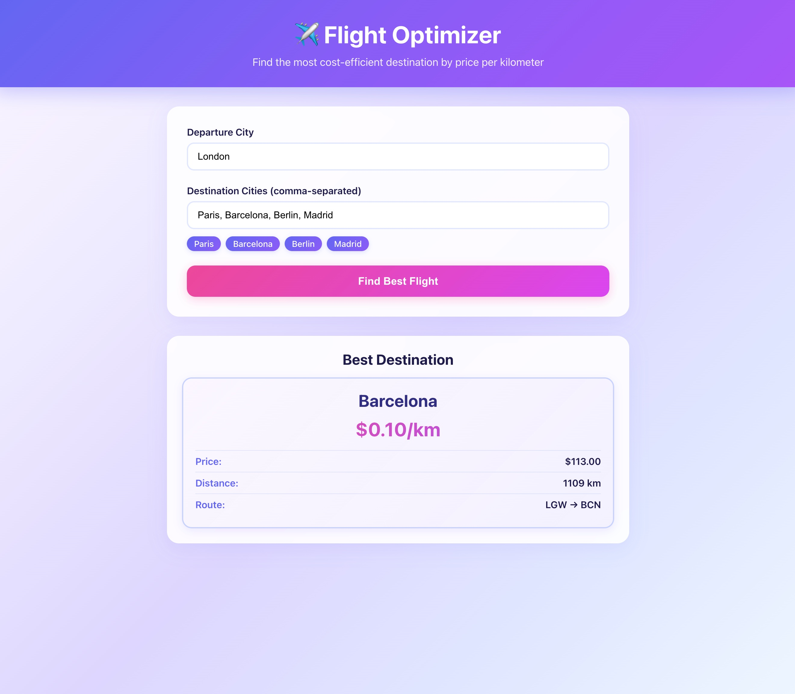

# ✈️ Flight Optimizer

Find the most cost-efficient flight destination by calculating price per kilometer for flights departing within the next 24 hours.

**Tech Stack:** Python 3.11+ (FastAPI), React + TypeScript (Vite), Vercel

**Demo:** [https://flight-optimizer-eight.vercel.app/](https://flight-optimizer-eight.vercel.app/)



## Quick Start

### Prerequisites
- Python 3.11+ (tested with 3.11.11)
- Node.js 22+ (tested with 22.x)

### Setup (2 minutes)

```bash
# 1. Set up API key
cp .env.example .env
# Edit .env and add your Kiwi API key

# 2. Install dependencies
pip install -r requirements.txt
cd frontend && npm install && cd ..
```

### Run Locally

**Terminal 1 - Backend:**
```bash
uvicorn api.index:app --reload --port 8000
```

**Terminal 2 - Frontend:**
```bash
cd frontend && npm run dev
```

Open http://localhost:5173

### CLI Usage

```bash
./flight-optimizer --from London --to Paris Berlin Madrid
```

Output:
```
Best destination: Paris
Price per kilometer: $0.44/km

Flight details:
  Price: $150.00
  Distance: 344 km
  Route: LHR → CDG
```

## Project Structure

```
bfly/
├── flight-optimizer          # CLI script
├── api/index.py          # FastAPI backend
├── optimizer/
│   ├── kiwi_client.py      # Kiwi API client
│   ├── flight_optimizer.py # Core logic
│   └── tests/              # Unit tests
├── frontend/src/
│   ├── components/         # React components
│   └── App.tsx            # Main app
├── requirements.txt
└── vercel.json            # Deployment config
```

## Features

- 🖥️ CLI and web interface
- 🔍 Automatic airport resolution (city → IATA code)
- 📊 Real-time flight search (next 24 hours)
- 📏 Geodesic distance calculation
- 💰 Price per km optimization
- ✅ Comprehensive test coverage

## Testing

```bash
# Run all tests
pytest optimizer/tests/ -v

# With coverage
pytest --cov=optimizer optimizer/tests/

# Test API directly
curl -X POST http://localhost:8000/optimize \
  -H "Content-Type: application/json" \
  -d '{"from_city": "London", "to_cities": ["Paris", "Berlin"]}'
```

## API Reference

### POST /optimize

**Request:**
```json
{
  "from_city": "London",
  "to_cities": ["Paris", "Berlin", "Madrid"]
}
```

**Response:**
```json
{
  "destination": "Paris",
  "price_per_km": 0.44,
  "price_usd": 150.00,
  "distance_km": 344.0,
  "airport_from": "LHR",
  "airport_to": "CDG"
}
```

## How It Works

1. User enters departure city and destinations
2. System resolves city names to IATA codes
3. Searches for cheapest flights in next 24 hours
4. Calculates geodesic distance between airports
5. Computes price per kilometer for each destination
6. Returns destination with lowest $/km ratio

## CLI Setup

```bash
# Create and activate virtual environment
python3 -m venv .venv
source .venv/bin/activate

# Install dependencies
pip install -r requirements.txt
```

## CLI Examples

```bash
# Single destination
./flight-optimizer --from "New York" --to Boston

# Multiple destinations
./flight-optimizer --from Tokyo --to Seoul Shanghai Bangkok

# Cities with spaces (use quotes)
./flight-optimizer --from "Los Angeles" --to "San Francisco" "Las Vegas"
```
